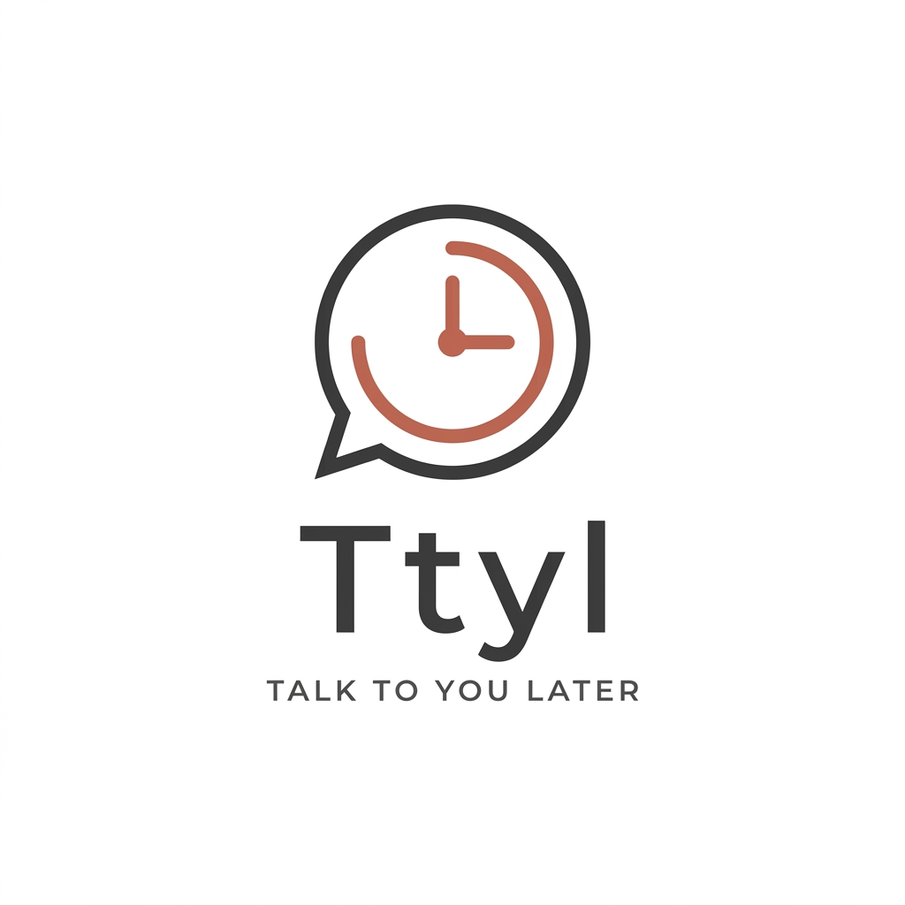

<div align="center">
  
  <h1>Ttyl · Talk To You Later</h1>
  <p><strong>A minimalist workspace and productivity timer for power users.</strong></p>
</div>

<br />

Ttyl (acrónimo de *"Talk To You Later"*) es una aplicación de escritorio open-source enfocada en ayudar a los desarrolladores y power-users a acceder a estados de "Deep Work" de forma rápida y minimalista.

Su filosofía central se resume en su propio nombre: *"Hablamos luego, ahora mismo estoy esculpiendo código"*. 

La aplicación silencia el ruido visual mediante una interfaz premium y ultra-minimalista inspirada en los principios de diseño de Claude/Anthropic (paleta de colores suave, tipografía limpia serif/sans combinada, acentos terracota y una extrema escasez de bordes).

## 🚀 Características Principales

- **Focus Mode Zen**: Temporizador minimalista gigantesco para que tu única preocupación sea la tarea en pantalla.
- **Paleta de Comandos Invocable**: Maneja toda la aplicación usando el teclado presionando `Ctrl + K`. Puedes cambiar tareas o el esquema de colores sin tocar el mouse.
- **Hooks del Sistema (Power-users)**: Integración nativa con Linux a través de Rust. Al iniciar o detener el temporizador, la aplicación intentará de forma silenciosa ejecutar scripts locales en tu entorno (`~/.config/ttyl/on_start.sh` y `on_stop.sh`), permitiéndote pausar tus notificaciones (Do Not Disturb), apagar Slack, o iniciar música lo-fi en Spotify automáticamente.
- **100% Persistencia Local**: Ttyl no necesita internet. Todo tu contexto (objetivos, configuración y tareas) se almacena nativamente y en plano como un `.json` en el interior tu directorio de configuración de aplicación bajo el paraguas de `Tauri FS Plugin`.
- **Markdown Friendly**: Escribe descripciones de tus tareas con sintaxis fluida.

---

## 🛠 Stack Tecnológico

Ttyl aprovecha la velocidad extrema de Rust y el ecosistema moderno de frontend:

- **Core/Backend:** Rust + Tauri v2
- **Frontend UI:** React 19 + TypeScript + Vite
- **Estilos:** Tailwind CSS v3
- **Componentes:** shadcn/ui minimalista, cmdk local, Lucide React
- **Datos Local:** Zustand + `@tauri-apps/plugin-fs`

---

## 💻 Ejecución y Desarrollo Local

Dado que Ttyl es una aplicación nativa envuelta con Tauri, necesitas ciertas bibliotecas de C/C++ instaladas en tu sistema Linux así como el compilador de Rust.

### Requisitos Previos

Asegúrate de instalar los binarios que compilan componentes WebKit y GTK necesarios en el sistema host en Ubuntu/Debian:

```bash
sudo apt update
sudo apt install -y pkg-config build-essential libwebkit2gtk-4.1-dev libssl-dev libgtk-3-dev libayatana-appindicator3-dev librsvg2-dev
```

### Inicialización

1. Instala las dependencias y bibliotecas de NPM empaquetadas:
```bash
npm install
```

2. Lanza el servidor en vivo:
```bash
npm run tauri dev
```

La aplicación compilará los Hooks expuestos por Rust y te lanzará la pantalla de Onboarding.

<br/>

*Designed for Flow. Build something wonderful. Ttyl.*
