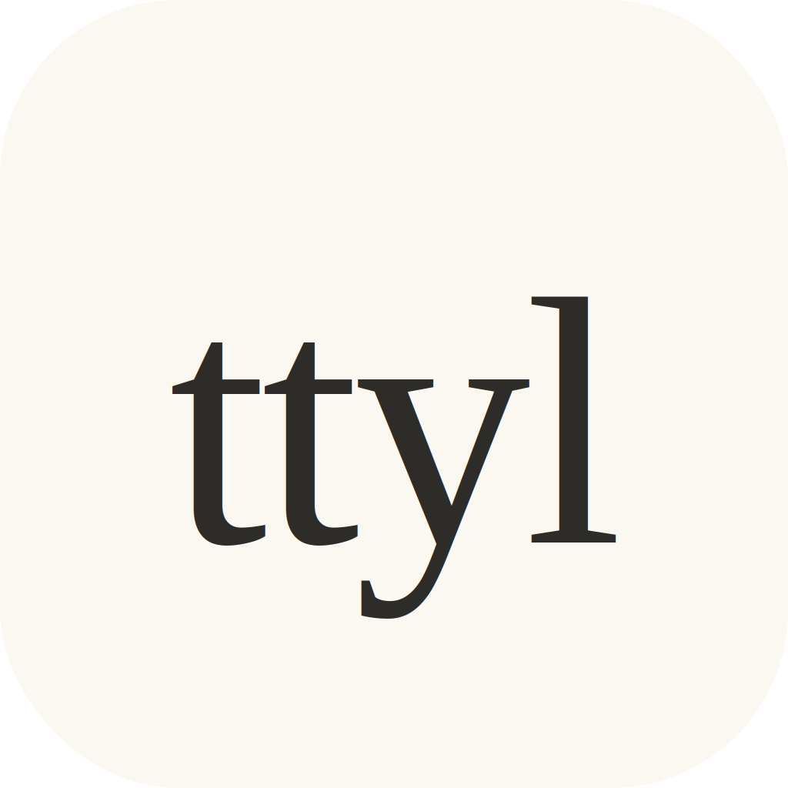

<div align="center">
  
  <h1>Ttyl · Talk To You Later</h1>
  <p><strong>A minimalist workspace and productivity timer for power users.</strong></p>

  [](https://opensource.org/licenses/MIT)
  [](https://tauri.app/)
  [](https://react.dev/)
  [](https://github.com/marcestruch/ttyl/releases)
</div>

<br />

**Ttyl** (short for *"Talk To You Later"*) is a premium, open-source desktop application designed to bridge the gap between intent and execution. It provides a distraction-free environment for developers and power users to access "Deep Work" states with zero friction.

Its core philosophy is simple: **"Talk to you later. I'm focusing right now."**

Inspired by modern minimalist design principles (soft color palettes, clean typography, and a "texture-first" aesthetic), Ttyl silences the digital noise so you can focus on what truly matters: your craft.

---

## ✨ Key Features

- **🧘 Zen Focus Mode**: A massive, immersive minimalist timer that hides everything except your current objective.
- **⌨️ Command-Driven UI**: A powerful command palette (`Ctrl + K`) that lets you manage your entire workflow without ever touching the mouse.
- **🦀 Native Automation Hooks**: Seamless Linux integration via Rust. Ttyl automatically triggers local scripts (`on_start.sh` and `on_stop.sh`) when you start or end a focus session.
    - *Use case*: Automatically toggle Do Not Disturb, pause Slack, or start your "Deep Work" playlist.
- **🔒 Privacy-First & Offline**: 100% local persistence. Your data never leaves your machine. Your goals and logs are stored in standard JSON files within your system configuration.
- **🎨 Premium Aesthetic**: A warm, user-centric interface inspired by Claude/Anthropic’s design language—soft creams, subtle shadows, and terracotta accents.

---

## 🛠 Tech Stack

Ttyl is built for speed and efficiency using a state-of-the-art modern stack:

### **Backend & Core**
- **[Rust](https://www.rust-lang.org/)**: Powering the native system interactions and performance-critical operations.
- **[Tauri v2](https://tauri.app/)**: Providing a secure, lightweight desktop wrapper with a tiny binary footprint.

### **Frontend & UI**
- **[React 19](https://react.dev/)**: For a declarative and responsive user interface.
- **[TypeScript](https://www.typescriptlang.org/)**: Ensuring type safety across the entire application.
- **[Tailwind CSS](https://tailwindcss.com/)**: For utility-first, modern styling.
- **[Zustand](https://github.com/pmndrs/zustand)**: A lightweight state management solution.
- **[Radix UI](https://www.radix-ui.com/)**: Accessible, unstyled primitives for high-quality components.
- **[cmdk](https://cmdk.paco.me/)**: A fast, composable command menu.

---

## 🚀 Getting Started

### **Prerequisites (Linux)**

Since Ttyl is a native application, you need to have the Rust compiler and WebKit/GTK development libraries installed on your system.

**For Ubuntu/Debian:**
```bash
sudo apt update
sudo apt install -y pkg-config build-essential libwebkit2gtk-4.1-dev libssl-dev libgtk-3-dev libayatana-appindicator3-dev librsvg2-dev
```

### **Quick Install (Linux)**

The easiest way to install Ttyl on Linux is using our one-line installation script. This will download the latest AppImage release and set it up in your application launcher automatically:

```bash
curl -sSL https://raw.githubusercontent.com/marcestruch/ttyl/main/install.sh | bash
```

### **Manual Build & Development**

1. **Clone the repository:**
   ```bash
   git clone https://github.com/marcestruch/ttyl.git
   cd ttyl
   ```

2. **Install dependencies:**
   ```bash
   npm install
   ```

3. **Run in development mode:**
   ```bash
   npm run tauri dev
   ```

4. **Build for production:**
   ```bash
   npm run tauri build
   ```

---

## ⚡ Automation Hooks

Ttyl allows you to automate your system state based on your focus status. Create the following files in your config directory (usually `~/.config/ttyl/` on Linux):

- **`on_start.sh`**: Executed when you click "Start Focus".
- **`on_stop.sh`**: Executed when the timer ends or is stopped.

### Example `on_start.sh`:
```bash
#!/bin/bash
# Enable Ubuntu Do Not Disturb
gsettings set org.gnome.desktop.notifications show-banners false
# Pause Slack (if running via flatpak)
flatpak kill com.slack.Slack
```

---

## 📝 License

Distributed under the **MIT License**. See `LICENSE` for more information.

---

<div align="center">
  <p><i>Designed for Flow. Build something wonderful. · <b>Ttyl.</b></i></p>
</div>
